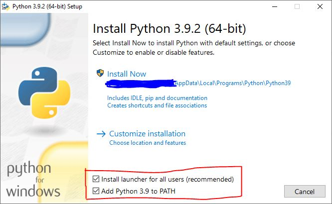
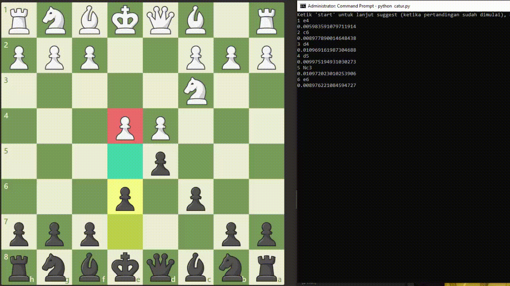

# Bot Auto Chess.com
Is a suggestion for chess moves on the chess.com platform. The available features are: chess suggestions and moves automatically.

## installation (Windows)

1. Install Python <br />
You can install it here [Python](https://www.python.org/downloads/). Don't forget to tick (Add Python to PATH)  
To check that Python has been successfully installed, open CMD and type "python", if python is run successfully then Python is successfully installed, but if directed to the Windows Store please solve it by following the advice from [stackoverflow](https://stackoverflow.com/questions/58754860/cmd-opens-window-store-when-i-type-python).
2. Clone Repository <br />
Install [Git](https://git-scm.com/download/win) in Windows, then run the command below:
```
cd C:\Users\USERNAMEWINDOWS\Desktop
git clone git@github.com:tinwaninja/Catur.git
cd Catur
pip install -r requirements.txt
```
3. Install Firefox <br />
To use this script you will need a browser [Mozilla Firefox](https://www.mozilla.org/en-US/firefox/new/).
## Setting up
1. Create an account <br />
Create an account on chess.com, by registering mode **beginner**. <br />
It is recommended to create a username with 5 words and 2 numbers, for example: abcde11 <br />
Confirm registration email.
2. Enter Credentials <br />
Open the file C:\Users\USERNAMEWINDOWS\Desktop\Catur\akun.txt <br />
Change your username and password credentials.
## Start
Open CMD (Administrator mode recommended), then run the command: <br />
```
cd C:\Users\USERNAMEWINDOWS\Desktop\Catur
python catur.py
```
The script will automatically open Mozilla Firefox and automatically login based on existing credentials. <br />
Next, start the match (Live Match).

If you get the first turn (in white) then please advance the pawn to e4. (For the first turn you have to run 1x first, but if you are the second turn the script will run automatically).
## Additional
You can change the movement speed of chess moves by changing the value of the blitz in the chess.py script on line 18 with the value "True" or "False".
## Thanks
This script is made from libraries and fixes existing scripts. In developing this script I am very grateful to:
1. [StockFish](https://stockfishchess.org/download/)
2. [ChessBot Linux](https://github.com/kraten/chessbot)
3. VIP-Spuc3ngine

## Disclaimer
This is purely for educational purposes, I am not responsible for misuse of the script.